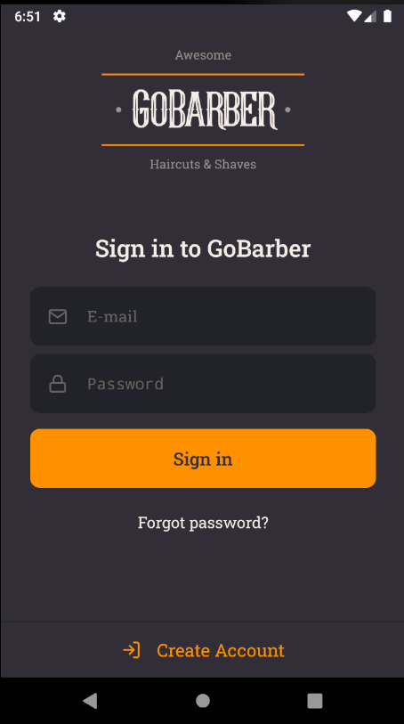
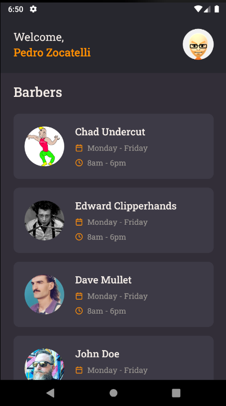

<h1 align="center">
  
</h1>

  <a href="#framed_picture-preview"> 🖼️ Preview</a> |
  <a href="#spiral_notepad-repositories"> 🗒️ Repositories</a> |
  <a href="#rocket-technologies"> 🚀 Technologies</a>

  

<h2 align="center">The best haircut and beard trim of your life!</h2>

## :framed_picture: Preview

## :construction: Project

This is the GoBarber central repository. You can check the individual repositories down below.

## :spiral_notepad: Repositories

### - [API](https://github.com/pedrozocatelli/gobarber-api)
### - [Web](https://github.com/pedrozocatelli/gobarber-web)
### - [App](https://github.com/pedrozocatelli/gobarber-app)

## :rocket: Technologies

### API

- [Node.js](https://nodejs.org/en/)
- [TypeScript](https://www.typescriptlang.org/)
- [ExpressJS](https://expressjs.com/pt-br/)
- [AmazonSES](https://aws.amazon.com/pt/ses/)
- [AmazonS3](https://aws.amazon.com/pt/s3/)
- [TypeORM](https://typeorm.io/#/)
- [Mime](https://www.npmjs.com/package/mime)
- [PostgresSQL](https://www.postgresql.org/)
- [MongoDB](https://www.mongodb.com/)
- [Redis](https://redis.io/)
- [IORedis](https://github.com/luin/ioredis)
- [JWT](https://jwt.io/)
- [date-fns](https://date-fns.org/)
- [Jest](https://jestjs.io/)

### Web

- [ReactJS](https://github.com/facebook/react)
- [TypeScript](https://www.typescriptlang.org/)
- [Axios](https://github.com/axios/axios)
- [Styled Components](https://styled-components.com/)

### App

- [React Native](https://github.com/facebook/react-native)
- [TypeScript](https://www.typescriptlang.org/)
- [Axios](https://github.com/axios/axios)
- [Styled Components](https://styled-components.com/)
